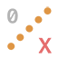

# Cinema 4D Python Scripts

This repository contains a collection of Python scripts for use with Cinema 4D. These scripts provide various functionalities to enhance your workflow in Cinema 4D.

## Table of Contents

- [Installation](#installation)
- [Usage](#usage)
- [Scripts](#scripts)
  - [Camera Filter](#camera-filterpy)
  - [Convert Hair to Spline](#convert-hair-to-splinepy)
  - [Copy-Paste Material Tags](#copy-paste-materialtags_v002py)
  - [Curve Repeat After Before](#curve_repeatafterbeforepy)
  - [Align Selected X](#m_align-selected-xpy)
  - [Align Selected Y](#m_align-selected-ypy)
  - [Align Selected Z](#m_align-selected-zpy)
  - [Align To Selected](#m_aligntoselectedpy)
  - [Align Zero Selected X](#m_alignzero-selected-xpy)
  - [Align Zero Selected Y](#m_alignzero-selected-ypy)
  - [Align Zero Selected Z](#m_alignzero-selected-zpy)
  - [AnimCurve Repeat After](#m_animcurve_repeatafterpy)
  - [Bounding Box Selected Objects](#m_boundingbox_selectedobjectspy)
  - [Camera Grid Toggle](#m_cameragridtoggle_01py)
  - [Copy Material Tags Hierarchy](#m_copymaterialtags_hierarchypy)
  - [Copy Color to Child](#m_copycolortochildpy)
  - [Copy Display Color](#m_copydisplaycolorpy)
  - [FFD Selected Objects](#m_ffd_selectedobjspy)
  - [FFD to Nulls](#m_ffd-to-nulls_01py)
  - [Paste as Child](#m_paste-as-childpy)
  - [Hierarchy Move Down](#m_hierarchymovednpy)
  - [Render Set 1-1](#m_renderset-1-1py)
  - [Hierarchy Move Up](#m_hierarchymoveuppy)
  - [Paste Next to](#m_pastenextopy)
  - [Render Set Res Div 2](#m_renderset_resdiv2py)
  - [Render Set Res Mult 2](#m_renderset_resmult2py)
  - [Render Set 9-16](#m_renderset-9-16py)
  - [Render Set 16-9](#m_renderset-16-9py)
  - [Render Set Current Frame](#m_renderset_currentframepy)
  - [Render Set Preview Range](#m_renderset_previewrangepy)
  - [Render Set Save ON OFF](#m_renderset_save-on-offpy)
  - [Render Set Save ON OFF v02](#m_renderset_save-on-off_v02py)
  - [Reset Visibility](#m_reset-visibilitypy)
  - [Reset Rotation](#m_resetrotationpy)
  - [Sampling Lower](#m_rset_samplinglowerpy)
  - [Sampling CTRL](#m_rset_samplingctrlpy)
  - [Bucket 64](#m_rsset_bucket64py)
  - [Cutoff Thresholds Q](#m_rsset_cutoffthresholds_qpy)
  - [Bucket 512](#m_rsset_bucket512py)
  - [Sampling Thresh 0x01](#m_rsset_samplingthresh_0x01py)
  - [Sampling Thresh 0x005](#m_rsset_samplingthresh_0x005py)
  - [Sampling Thresh 0x1](#m_rsset_samplingthresh_0x1py)
  - [Sampling Thresh 1](#m_rsset_samplingthresh_1py)
  - [Viewport Clean](#m_viewportclean_01py)
  - [Select Children](#m_select-childrenpy)
  - [Swap Index Number](#m_swapindexnumberpy)
  - [Points to Circle](#points2circlepy)
  - [Point Auto Rig](#point_autorigpy)
  - [Remove Empty Nulls](#remove-empty-nullspy)
  - [Render All Frames](#renderallframespy)
  - [Visibility Off](#visibility-offpy)
  - [Render Current Frame](#rendercurrentframepy)
  - [Visibility Toggle](#visibility-tog_01py)
  - [Visibility 2](#vis2py)
  - [Random Color Group](#m_randomcolor_grouppy)

## Installation

1. Download or clone this repository to your local machine.
2. Open Cinema 4D.
3. Go to `Script` > `Script Manager`.
4. Click on `File` > `Load Script` and select the desired script from the downloaded repository.

## Usage

Each script provides a specific functionality. To use a script, follow these steps:

1. Load the script into Cinema 4D using the Script Manager.
2. Select the objects or elements in your scene that you want to apply the script to.
3. Execute the script by clicking the `Execute` button in the Script Manager.

## Scripts

###  Camera Filter.py
Toggles the display filter for the camera.

###  Convert Hair to Spline.py
Converts a selected Hair object to a spline.

###  copy-paste-materialTags_v002.py
Copies material tags from one hierarchy to another with the same objects.

###  Curve_RepeatAfterBefore.py
Applies the "Repeat After" and "Repeat Before" options to the selected timeline.

###  m_Align Selected X.py
Aligns selected vertices on the X axis.

###  m_Align Selected Y.py
Aligns selected vertices on the Y axis.

###  m_Align Selected Z.py
Aligns selected vertices on the Z axis.

###  m_AlignToSelected.py
Aligns the first selected object to the second selected object.

###  m_AlignZero Selected X.py
Aligns selected vertices to the origin on the X axis.

###  m_AlignZero Selected Y.py
Aligns selected vertices to the origin on the Y axis.

###  m_AlignZero Selected Z.py
Aligns selected vertices to the origin on the Z axis.

###  m_AnimCurve_RepeatAfter.py
Repeats the animation curve after and before.

###  m_BoundingBox_SelectedObjects.py
Creates a bounding box around selected objects.

###  m_CameraGridToggle_01.py
Toggles the camera grid on and off.

###  m_CopyMaterialTags_Hierarchy.py
Copies material tags from one hierarchy to another with the same objects.

###  m_CopyColortoChild.py
Copies the display color from the parent to the children of selected objects.

###  m_copyDisplayColor.py
Copies the display color from the first selected object to the second selected object.

###  m_FFD_SelectedObjs.py
Adds an FFD object to selected objects.

###  m_FFD to nulls_01.py
Converts FFD points to nulls.

###  m_Paste as child.py
Pastes objects as children of the current selection.

###  m_HierarchyMoveDN.py
Moves selected objects down in the hierarchy.

###  m_RenderSet 1-1.py
Sets the render resolution to 1920x1920.

###  m_HierarchyMoveUP.py
Moves selected objects up in the hierarchy.

###  m_PasteNexto.py
Pastes objects next to the selected object in the object manager.

###  m_RenderSet_ResDiv2.py
Divides the frame resolution by 2.

###  m_RenderSet_ResMult2.py
Multiplies the frame resolution by 2.

###  m_RenderSet 9-16.py
Sets the render resolution to 1080x1920.

###  m_RenderSet 16-9.py
Sets the render resolution to 1920x1080.

###  m_RenderSet_CurrentFrame.py
Sets the frame range to "Current Frame".

###  m_RenderSet_PreviewRange.py
Sets the frame range to "Preview Range".

###  m_RenderSet_Save ON OFF.py
Toggles the save output on and off.

###  m_RenderSet_Save ON OFF_v02.py
Toggles the save output on and off with a command plugin.

###  m_Reset Visibility.py
Resets the visibility of selected objects.

###  m_ResetRotation.py
Resets the rotation of selected objects.

###  m_rset_SamplingLower.py
Lowers the sampling threshold for Redshift renderer.

###  m_rset_SamplingCTRL.py
Controls the sampling threshold for Redshift renderer with keyboard modifiers.

###  m_rsSet_Bucket64.py
Sets the Redshift bucket size to 64.

###  m_rsSet_CutoffThresholds_Q.py
Sets the cutoff thresholds for Redshift renderer.

###  m_rsSet_Bucket512.py
Sets the Redshift bucket size to 512.

###  m_rsSet_SamplingThresh_0x01.py
Sets the Redshift sampling threshold to 0.01.

###  m_rsSet_SamplingThresh_0x005.py
Sets the Redshift sampling threshold to 0.005.

###  m_rsSet_SamplingThresh_0x1.py
Sets the Redshift sampling threshold to 0.1.

###  m_rsSet_SamplingThresh_1.py
Sets the Redshift sampling threshold to 1.

###  m_ViewportClean_01.py
Cleans up the viewport by toggling various display options.

###  m_Select Children.py
Selects the children of the selected objects.

###  m_SwapIndexNumber.py
Swaps the index number of points.

###  Points2Circle.py
Converts selected points to a circle.

###  point_autorig.py
Automatically rigs points with nulls.

###  Remove Empty Nulls.py
Removes empty null objects from the scene.

###  RenderAllFrames.py
Sets the render frame sequence to all frames.

###  Visibility Off.py
Turns off the visibility of selected objects.

###  RenderCurrentFrame.py
Sets the render frame sequence to the current frame.

###  Visibility Tog_01.py
Toggles the visibility of selected objects.

###  Vis2.py
Toggles the visibility of selected objects.

###  m_RandomColor_Group.py
Sets a random display color to the current object or tag selection.

## License

This project is licensed under the Creative Commons Legal Code CC0 1.0 Universal. See the [LICENSE](LICENSE) file for details.
