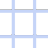
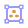

# m_Scripts_1.1.0 C4D

A collection of Python scripts for Cinema 4D. These scripts provide various functionalities to enhance and speedup your workflow. Some are mostly shorcuts to simple tasks.

## Changelog

### **Latest Version 1.2.0** - *(19.25.2025)*

#### *Updated*
 - m_AlignToSelected - Updated to work on multiple objects
 - m_HierarchyMoveDN - Added AlT functionality to send to Bottom on Object Manager
 - m_HierarchyMoveUP - Added AlT functionality to send to Top on Object Manager
 - m_MakeChildren - Updated to work on multiple objects
 - m_SceneArrange - Added Pop-up Menu to select what to arrange
 - m_copyDisplayColor - Updated to work on multiple objects

#### *Added*
 - m_AnimationCopyToSelected.py
 - m_ResetPosition
 - m_FlattenPolygons
 - m_DistributeObjects_XYZ
 - m_SetAsFocus

### **Version 1.1.0** - *(19.02.2025)*
#### *Added* 
  - m_MakeChildren.py
  - m_PasteMatchSelection.py
  - m_AxisToBottom.py

 

## Table of Contents

- [Installation](#installation)
- [Scripts](#scripts-overview)
  - [Animation](#animation)
  - [Modeling](#modeling)
  - [Object Manager](#object-manager)
  - [Render](#render)
  - [Utility](#utility)

# Installation

Download or clone this repository to your local machine.

#### Windows
`C:\Users\<USER>\AppData\Roaming\MAXON\Maxon Cinema 4D 2025\library\scripts\m_scripts`

#### Mac OS
`/Applications/MAXON/CINEMA 4D 2025/library/scripts/m_scripts`

### Using scripts
After you have installed m_Scripts you have to reboot Cinema 4D if it is already running. Scripts are located under Extensions -> User Scripts -> M_Scripts_#.##. Scripts can be used with the commander (Shift+C) too.

Some of the scripts have multiple functions and you can use those with key modifiers (Alt / Ctrl / Shift) and different combinations. Some of the scripts requires a certain item selection or mode to be active. If you don't know what the script does you can either open the script in the script editor and read the description or search the info of the specific script on this page.

# Scripts Overview

## Animation

####  AnimCurve Constant

*-* Makes the animation curve constant before and after.

####  AnimCurve Repeat After

*-* Repeats the animation curve before and after.

## Modeling

####  Align Selected X

*-* Aligns selected vertices on the X axis.

####  Align Selected Y

*-* Aligns selected vertices on the Y axis.

####  Align Selected Z

*-* Aligns selected vertices on the Z axis.

####  Align Zero Selected X

*-* Aligns selected vertices to the origin on the X axis.

####  Align Zero Selected Y

*-* Aligns selected vertices to the origin on the Y axis.

####  Align Zero Selected Z

*-* Aligns selected vertices to the origin on the Z axis.

####  Flatten Polygons

*-* Flattens selected polygons along the specified axis.

## Object Manager

####  Align To Selected

*-* Aligns the first selected object to the second selected object.

####  Copy Display Color

*-* Copies the display color from the first selected object to the second selected object.

####  Paste Match Selection

*-* Pastes an object matching the coordinates of the currantly selected object.

####  Copy Color to Child

*-* Copies the display color from the parent to the children of selected objects.

####  Random Color Group

*-* Sets a random display color to the current object or tag selection.

####  Copy Material Tags Hierarchy

*-* Copies material tags from one hierarchy to another with the same objects.

####  Paste Next to

*-* Pastes objects next to the selected object in the object manager. *Recommended to use with shortcut*

####  Paste as Child

*-* Pastes objects as children of the current selection. *Recommended to use with shortcut*

####  Select Children

*-* Selects the children of the selected objects.

####  Hierarchy Move Down

*-* Moves selected objects down in the hierarchy.

####  Hierarchy Move Up

*-* Moves selected objects up in the hierarchy.

####  Make Children

*-* Makes selected objects children of the last selected object.

####  Scene Arrange

*-* Groups objects in the scene into categories under new null objects. *Still needs some improvement*

####  Scene Arrange Cloners

*-* Groups each selected cloner and its effectors under a new null object.

####  Axis To Bottom

*-* Moves the axis of the selected objects to the bottom.

####  Distribute Objects X

*-* Distributes selected objects along the X axis.

####  Distribute Objects Y

*-* Distributes selected objects along the Y axis.

####  Distribute Objects Z

*-* Distributes selected objects along the Z axis.

## Render Setup

####  Render Set 1-1

*-* Sets the render resolution to 1920x1920.

####  Render Set 16-9

*-* Sets the render resolution to 1920x1080.

####  Render Set 9-16

*-* Sets the render resolution to 1080x1920.

####  Render Set Current Frame

*-* Sets the frame range to "Current Frame".

####  Render Set Preview Range

*-* Sets the frame range to "Preview Range".

####  Quick Redshift Render Setting Preset

*-* Configures the Redshift renderer to a Basic quick render setting:

1. Disables automatic sampling.
2. Sets cutoff thresholds to 0.01.
3. Sets the adaptive error threshold to 0.1.
4. Sets the maximum samples for unified sampling and other related parameters to 32.
5. Configures the secondary Global Illumination (GI) engine to Brute Force and sets the number of rays.
6. Sets the block size to 512.

*Make sure to set Render Mode to **Advanced***

####  Sampling CTRL

*-* Multiplies by x2 the "Unified Max Samples" Sampling overrides and Brute Force Rays.   *If "Sampling Overrides" are higher than Unified Max Samples it will multiply this value by x2, otherwise it will take Max Samples value*   *-* If ALT is pressed, the sampling values are halved; instead of doubled. 

####  Bucket 64

*-* Sets the Redshift bucket size to 64.

####  Bucket 512

*-* Sets the Redshift bucket size to 512.

####  Cutoff Thresholds Q

*-* Sets the cutoff thresholds for Redshift renderer to 0.01 to speedup rendering.  
*Use with Caution may introduce fireflyes in certain scenarios*

####  Sampling Threshold 0.005

*-* Sets the Redshift sampling threshold to 0.005.

####  Sampling Threshold 0.01

*-* Sets the Redshift sampling threshold to 0.01.

####  Sampling Threshold 0.1

*-* Sets the Redshift sampling threshold to 0.1.

####  Sampling Threshold 1

*-* Sets the Redshift sampling threshold to 1.

## Utility

####  Camera Grid Toggle

*-* Toggles the camera grid on and off. *Recommended to use with shortcut*

####  Bounding Box Selected Objects

*-* Creates a bounding box around selected objects.

####  FFD Selected Objects

*-* Adds an FFD object to selected objects.

####  FFD to Nulls

*-* Converts FFD points to nulls.

####  FFD Selected Verts

*-* Adds an FFD object to selected vertices.

####  FFD to Nulls

*-* Converts FFD vertices into Null objects.

####  FFD Selected Objs

*-* Adds FFD object to selected objects.

####  Visibility Toggle

*-* Toggles the visibility of selected objects. *Recommended to use with shortcut Shift+V*

####  Viewport Clean

*-* Cleans up the viewport by toggling various display options. *Recommended to use with shortcut*

####  Reset Visibility

*-* Resets the visibility of selected objects.

####  Reset Rotation

*-* Resets the rotation of selected objects.

####  Reset Position

*-* Resets the position of selected objects to the origin.

####  Remove Empty Nulls

*-* Removes empty null objects from the scene.

####  Batch Export Objects

Batch exports selected objects to file root as selected format.

####  Viewport Clean

*-* Cleans up the viewport by toggling various display options.

####  Set As Focus

*-* Sets the selected object as the focus point.

# License

This project is licensed under the Creative Commons Legal Code CC0 1.0 Universal. See the [LICENSE](LICENSE) file for details.
